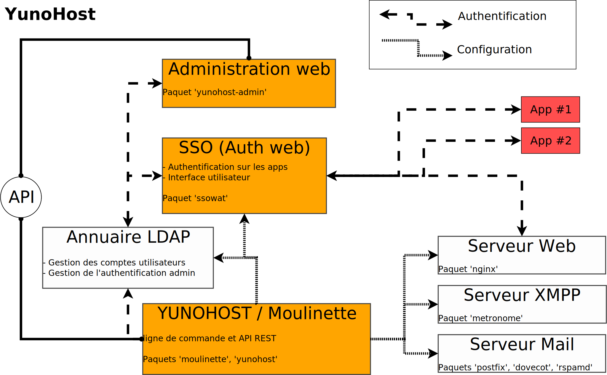

name:begin
class: center, middle


---
name: map
## Plan

- Qu'est-ce que c'est ?
- Comment ça fonctionne ?
- Quel code ?
- Infrastructure
- Équipe & gouvernance
- Comment contribuer
- Outils de développement
- Liens utiles

---

## Qu'est-ce que c'est ?

- Distribution Linux, basé sur Debian

--

- Simplification de l'auto-hébergement 
  - Serveur Mail
  - Serveur XMPP
  - Serveur Web

--

- Administration facilitée 
  - Interface web
  - Ligne de commande


---

## Qu'est-ce que c'est ?

### Auto-hébergement

- Mail (postfix, dovecot, rspamd)
- XMPP (metronome)
- Web : Apps & SSO (Nginx)

---

## Qu'est-ce que c'est ?

### Administration facilitée

- Utilisateurs
- Domaines
- Applications
- Services
- Firewall
- Backups

---
name:ynh-help

```bash
root@yourte:~# yunohost --help
usage: yunohost [-h] [--no-cache] [--output-as {json,plain}] [--debug]
                [--verbose] [--quiet] [--admin-password PASSWORD] [-v]
                {domain,monitor,service,firewall,tools,app,hook,dyndns,backup,user}
                ...

optional arguments:
  -h, --help            show this help message and exit

categories:
  {domain,monitor,service,firewall,tools,app,hook,dyndns,backup,user}
    domain              Manage domains
    monitor             Monitor the server
    service             Manage services
    firewall            Manage firewall rules
    tools               Specific tools
    app                 Manage apps
    hook                Manage hooks
    dyndns              Subscribe and Update DynDNS Hosts
    backup              Manage backups
    user                Manage users

global arguments:
  --no-cache            Don't use actions map cache
  --output-as {json,plain}
                        Output result in another format
  --debug               Log and print debug messages
  --verbose             Be more verbose in the output
  --quiet               Don't produce any output
  --admin-password PASSWORD
                        The admin password to use to authenticate
  -v, --version         Display YunoHost packages versions

```

---

## Comment ça fonctionne ?



---

## Comment ça fonctionne ?


---

## Comment ça fonctionne ?

### Moulinette

ActionMap : 1 fichier .yml pour définir les url API & CLI

```yml
### user_info()
info:
    action_help: Get user information
    api: GET /users/<username>
    configuration:
        authenticate: all
        authenticator: ldap-anonymous
    arguments:
        username:
            help: Username or email to get information

```

→ `$ yunohost user info <USERNAME>`    
→ `https://example.com/yunohost/api/users/<USERNAME>`

---

## Comment ça fonctionne ?

### Domaines

- Possibilité de DynDNS
- Certificats SSL (auto-signés, Let's Encrypt à venir)

---

## Comment ça fonctionne ?

### Applications

- Packages YunoHost basés sur des scripts bash
- Dépots d'applications (listes json)
- Organisation GitHub spécifique : [github.com/YunoHost-Apps](https://github.com/YunoHost-Apps)

---

## Quel code ?

### Moulinette / YunoHost

- Python
- Catégories / actions définies dans un fichier YAML (actionsmap)
- Hooks en bash

#### Dépots Git

- Moulinette [github.com/YunoHost/moulinette](https://github.com/YunoHost/moulinette)
- YunoHost [github.com/YunoHost/yunohost](https://github.com/YunoHost/yunohost)

---

## Quel code ?

### Administration Web

- HTML/CSS/JS
- Routeur en Sammy.js
- Templates en Handlebars (mustache)

#### Dépots Git

- Admin web [github.com/YunoHost/yunohost-admin](https://github.com/YunoHost/yunohost-admin)

---

## Quel code ?

### SSOwat

- module Lua pour Nginx
- HTML/CSS/JS pour l'interface utilisateur

#### Dépots Git

- SSOwat [github.com/YunoHost/SSOwat](https://github.com/YunoHost/SSOwat)

---

## Quel code ?

### Dynette (DynDNS)

- Ruby
- Python

#### Dépots Git

- Dynette [github.com/YunoHost/Dynette](https://github.com/YunoHost/Dynette)

---

## Quel code ?

### Applications

- Scripts Bash
- Helpers

Application d'exemple : [github.com/YunoHost/example_ynh](https://github.com/YunoHost/example_ynh)

---

## Outils de développement

Basé sur des VM Vagrant

- https://github.com/YunoHost/ynh-dev

---

## Infrastructure

### Tartare

- Services web (site web, bugtracker, traduction, apps lists, pastebin)
- IP webservice (ip.yunohost.org )
- XMPP (salon support & dev)
- DynDNS
- NS0

---

## Infrastructure

### Veganaise

- Rebuildd (build *.deb)
- Debian repositories (repo.yunohost.org)
- ISOs & VMs (build.yunohost.org)
- NS1

---

## Infrastructure

### Autres machines

- Forum
- Demo (merci Web4All)

---

## Équipe & gouvernance

- petite équipe pour l'instant
- do-ocracy
- **New** BugTracker => suivi

---

## Comment contribuer ?

- Doc
- Support
- Code
- Faire des rapports de bugs (et comment faire un bon rapport de bug)
- Traduction
- Apps
- ...

---

## Comment contribuer ?

### Documentation

- Via github ([github.com/YunoHost/doc](https://github.com/YunoHost/doc))
- Directement via le site, édition en ligne (\#promesse)
- Wiki de La Brique Internet [wiki.labriqueinter.net](https://wiki.labriqueinter.net)

---

## Comment contribuer ?

### Support

- Salon XMPP [support@conference.yunohost.org](xmpp:support@conference.yunohost.org)
- IRC [#labriqueinter.net sur Geeknode](irc://irc.geeknode.org/labriqueinter.net)
- Forum : [forum.yunohost.org](https://forum.yunohost.org)
- Mailing lists
    - LaBriqueInternet [discussions@listes.labriqueinter.net](https://listes.labriqueinter.net/mailman/listinfo/discussions)

---

## Comment contribuer ?

### Code

- Salon XMPP [dev@conference.yunohost.org](xmpp:dev@conference.yunohost.org)
- Bug tracker [dev.yunohost.org](https://dev.yunohost.org)
- Github [github.com/YunoHost](https://github.com/YunoHost)

---
name:links
## Liens utiles

- Site web / doc : [yunohost.org](https://yunohost.org)
- Bug tracker : [dev.yunohost.org](https://dev.yunohost.org)
- Salons de discussion XMPP
    - Support : [support@conference.yunohost.org](xmpp:support@conference.yunohost.org)
    - Developement : [dev@conference.yunohost.org](xmpp:dev@conference.yunohost.org)
- Organisation Github [github.com/YunoHost](https://github.com/YunoHost)
    - Moulinette [github.com/YunoHost/moulinette](https://github.com/YunoHost/moulinette)
    - YunoHost [github.com/YunoHost/yunohost](https://github.com/YunoHost/yunohost)
    - Admin web [github.com/YunoHost/yunohost-admin](https://github.com/YunoHost/yunohost-admin)
    - SSOwat [github.com/YunoHost/SSOwat](https://github.com/YunoHost/SSOwat)
    - Documentation [github.com/YunoHost/doc](https://github.com/YunoHost/doc)
- Dépots d'applications : [github.com/YunoHost-Apps](https://github.com/YunoHost-Apps)
- Mailing Lists [list.yunohost.org](https://list.yunohost.org)
    - Apps Maintainers [apps@list.yunohost.org](https://list.yunohost.org/cgi-bin/mailman/listinfo/apps)
    - Contributors [contrib@list.yunohost.org](https://list.yunohost.org/cgi-bin/mailman/listinfo/contrib)

---
name: end
class: center, middle

